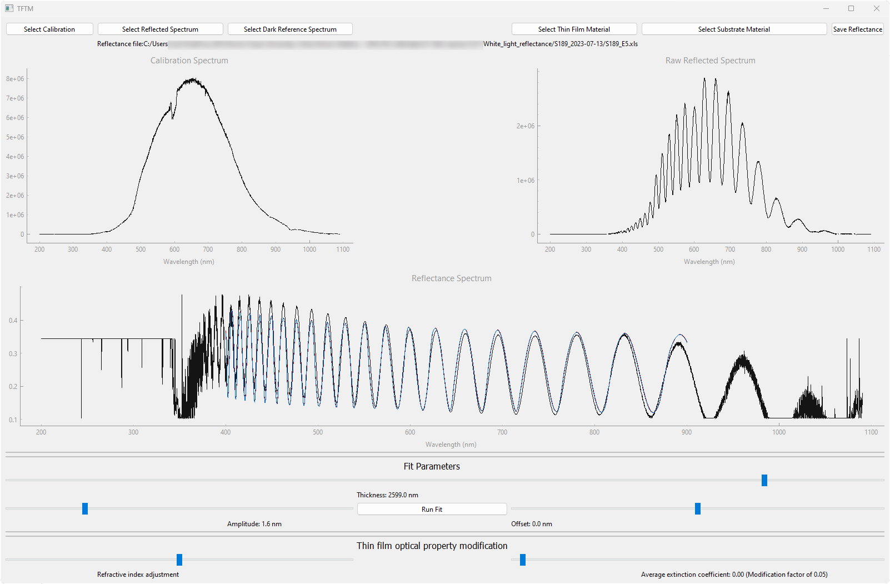

# TFTM
Thin Film Thickness Measurement (TFTM) is a tool for analysing white light reflectance data to measure a thin film's thickness.



## Installation
This tool uses several python packages that can be installed using pip. They are:
 - PySide6 https://doc.qt.io/qtforpython-6/index.html
 - PyQtGraph https://pyqtgraph.readthedocs.io/en/latest/
 - Numpy https://numpy.org/
 - Scipy https://scipy.org/

`pip install PySide6 pyqtgraph numpy scipy`

## Usage

### Loading Files

First, load material properties:
 - Load substrate material
 - Load thin film material

The properties of interest are the refractive index and the extinction coefficient as a function of wavelength. Example files are provided in the Materials folder. https://refractiveindex.info/ is a good source for more.

Next, load the dark spectrum and calibration file. The dark spectrum is a spectrum at a representative exposure time, but without any incident light. The calibration spectrum is the raw spectrum of the lamp, usually this is obtained by using a mirror instead of a wafer.

Finally, load the reflected spectrum. It should be visible in the top right plot. The calculated reflectance should also be visible in the lower plot.

### Fitting

Adjust the main thickness, amplitude and offset sliders to set the initial guess. Because of the corrugated surface, the initial guess has to be quite good for the fit to work.

Then press "Run Fit" to converge to the best fit from this initial guess. The program will move the sliders to the resulting values from the fit.

The two lower slider, for index adjustment and extinction coefficient adjustment modify the thin film material properties to explore potential implication of them changing. Warning, adjusting the refractive index lets you set non-physical properties for the film and may result in incorrect thickness values. Adjusting the extinction coefficient value is more likely needed, as different film qualities can affect attenuation.

## Technical Notes

### Supported Spectrometers

This program is written to accept files from the following spectrometer:
 - Photon Control SPM-001 and SPM-002 exported as .xls files from their SpecSoft program

### Calculations

Reflectance is calculated by considering the ratio of the reflected flux to the calibration flux. Note this is flux, not absolute counts.

Flux is calculated by:

```
Flux = (spectrum - dark) / exposure_time
```

For the supported spectrometers, the dark spectrum is hardly affected by exposure times of reasonable values, so only one dark spectrum is needed.

Also, this program supports exposure stacking. Rather than comparing a single, noisy, spectrum. This averages over N spectra that you decide to capture. Normally, this is 50 or 100.
